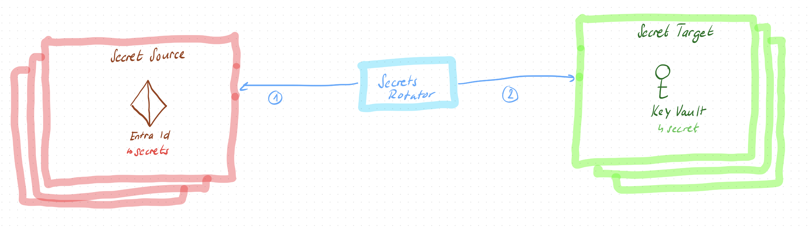

# Secret Rotation Bicep Local Extension (Experimental)

Custom Bicep Local Extension to rotate secrets from source (e.g. Entra Id) and save it in target (e.g. KeyVault) using Bicep.

> [!WARNING]
> Local-Deploy is an experimental Bicep feature and is subject to change.

## Capabilities



1. Create/Rotate secrets in **source**:
   1. Entra Id (App Registration)
2. Save/Update rotated secrets at **target**:
   1. Azure Key Vault with [Key Vault Data Plane Extension](https://github.com/anthony-c-martin/bicep-ext-keyvault)

## Prerequisites

- Bicep CLI v0.37.4+ (for `local-deploy`)

### For development

- .NET 9 SDK
- Github CLI
- Bash + jq

## How to use it

Here are the steps to run it without any additional setup using ACR or locally.

### Azure container registry

1. Copy `sample` folder to your project
2. Update `sample\main.bicepparam` with your params (e.g. TenantId, secrets to map)
    ```bicep
    using 'main.bicep'

    param secretRotations = [
      {
        source: {
          tenantId: '{YOUR-TENANT-ID}'
        }
        target: {
          keyVault: 'secretrotationkv'
        }
        secretTransfers: [
          {
            sourceSecretKey: {
              appRegistrationName: 'expiredSecretApp'
              secretName: 'expiredSecretNameInEntraId'
            }
            targetSecretKey: 'secretNameInKeyVault'
          }
        ]
      }
    ]
    ```
3. Use for example a pipeline which runs periodically (e.g. Azure DevOps Pipeline):
```yml
schedules:
  - cron: "0 20 1 * *" 
    displayName: Monthly Secret Rotation
    branches:
      include:
        - master

jobs:
  - job: RotateSecrets
    displayName: Rotate Azure Secrets
    pool:
      vmImage: ubuntu-latest
    steps:
      - task: AzureCLI@2
        displayName: rotate
        inputs:
          azureSubscription: "{YOUR_SERVICE_CONNECTION}"
          scriptType: "pscore"
          scriptLocation: inlineScript
          inlineScript: |
            $env:BICEP_TRACING_ENABLED = "true"
            bicep local-deploy ./bicep/secret-rotation/main.bicepparam
```

Have a look at my [blog post](http://shpend-kelmendi.ch/2025/12/08/deploy-multiple-tenants) if you want to know how enable your service connection for multi tenant deployment.

### Local Development

Run the scripts from root folder.

1. Publish and run secret rotation extension locally:  
    ```powershell
    .\infra\scripts\publish.ps1 -Target ./secret-rotation-extension
    ```
    This will publish the extension and make it available in your bicep file
2. Update `sample\main.bicepparam` with your params (e.g. TenantId)
    ```bicep
    using 'main.bicep'

    param secretRotations = [
      {
        source: {
          tenantId: '{YOUR-TENANT-ID}'
        }
        target: {
          keyVault: 'secretrotationkv'
        }
        secretTransfers: [
          {
            sourceSecretKey: {
              appRegistrationName: 'expiredSecretApp'
              secretName: 'expiredSecretNameInEntraId'
            }
            targetSecretKey: 'secretNameInKeyVault'
          }
        ]
      }
    ]
    ```
3. Run your local bicep deployment
    ```powershell
    ~/.azure/bin/bicep local-deploy .\sample\main.bicepparam
    ``` 

### Enable Debugging

If you get any errors, enable Tracing to understand errors by setting environment variable:
```powershell
$env:BICEP_TRACING_ENABLED = "true"
```

## Disclaimer

Sample only – not an official Microsoft supported extension. Use at your own risk.